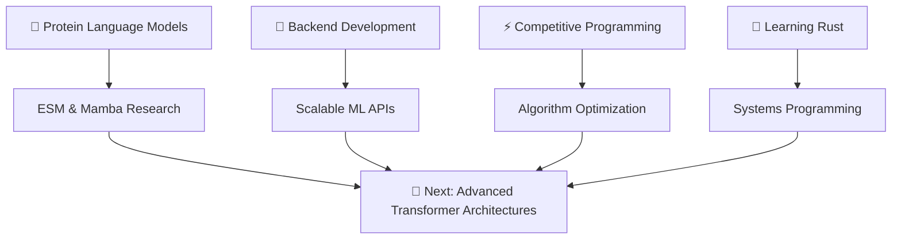

<div align="center">

# 👋 Hi there, I'm w39011651!


### 🎓 YZU Computer Science Student | 🧬 Protein Language Model Enthusiast | 🚀 Backend Developer

</div>

---

## 🤖 About Me

```python
class Developer:
    def __init__(self):
        self.name = "w39011651"
        self.university = "Yuan Ze University (YZU)"
        self.current_focus = ["Deep Learning", "Protein Language Models", "Backend Development"]
        self.interests = ["ESM", "Mamba", "Competitive Programming", "Docker"]
        self.currently_learning = "Rust 🦀"
        self.fun_fact = "I deploy ML models on GCP like a pro! ☁️"
    
    def say_hi(self):
        print("Thanks for dropping by! Let's build something amazing together! 🚀")

me = Developer()
me.say_hi()
```

---

## 🛠️ Tech Stack

### Languages


### AI/ML & Frameworks


### DevOps & Cloud


---

## 📊 GitHub Stats

<div align="center">
  


</div>

---

## 🧬 Featured Project: BiologyInformation-FinalProject

<div align="center">
  
[](https://github.com/w39011651/BiologyInformation-FinalProject)

</div>

### 🎯 Project Highlights:
- 🧠 **Deep Learning**: Implemented protein language models (ESM, Mamba)
- 🌐 **Full-Stack**: Complete web application with frontend and backend
- 🏗️ **Architecture**: msCNN + Transformer + Mamba hybrid architecture
- 🐳 **DevOps**: Dockerized deployment on Google Cloud Platform
- 🔬 **Research**: Advanced bioinformatics and computational biology

---

## 🎯 Current Focus


```mermaid
graph TD
    A[🧬 Protein Language Models] --> B[ESM & Mamba Research]
    C[🚀 Backend Development] --> D[Scalable ML APIs]
    E[⚡ Competitive Programming] --> F[Algorithm Optimization]
    G[🦀 Learning Rust] --> H[Systems Programming]
    
    B --> I[🎯 Next: Advanced Transformer Architectures]
    D --> I
    F --> I
    H --> I
```

---

## 🔥 Recent Activities

<!--START_SECTION:activity-->
- 🧬 Deployed protein language model pipeline on GCP
- 🐳 Optimized Docker containers for ML workloads  
- 🔍 Researching Mamba architecture for biological sequences
- 🦀 Learning Rust for high-performance computing
<!--END_SECTION:activity-->

---

## 📈 Coding Activity

<!--START_SECTION:waka-->
```text
Python       ████████████████████░   76.4%
HTML         █████░░░░░░░░░░░░░░░░   22.2%
Dockerfile   ░░░░░░░░░░░░░░░░░░░░░    1.4%
```
<!--END_SECTION:waka-->

---

## 🌐 Connect with me

<div align="center">

[](mailto:alter39011651@gmail.com)
[](https://github.com/w39011651)

</div>

---

<div align="center">

### 💭 Random Dev Quote


### 🐍 Contribution Snake


---

**Thanks for visiting! 🚀**


</div>
